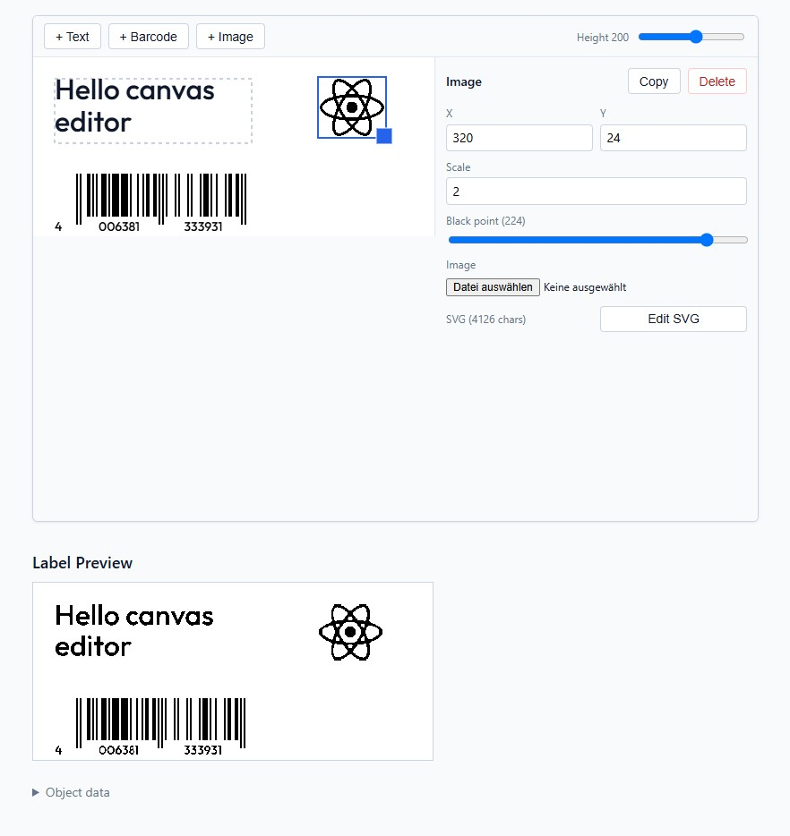

# react-canvas-label-editor

React class component for editing a template for a 1-bit canvas-rendered label, plus a Node.js rasterizer that produces the final PNG.



```
npm i github:sebseb7/react-canvas-label-editor#v12.0.0
```

## Usage

```jsx
import { Component } from 'react'
import { CanvasEditor, CANVAS_HEIGHT_DEFAULT, renderLabel } from 'react-canvas-label-editor'
import 'react-canvas-label-editor/style.css'

class App extends Component {
  state = {
    height: CANVAS_HEIGHT_DEFAULT,
    objects: [
      {
        id: '1',
        type: 'textbox',
        text: 'Hello',
        font: 'outfit',
        x: 24,
        y: 24,
        w: 200,
        h: 80,
      },
    ],
  }

  render() {
    const { height, objects } = this.state

    return (
      <CanvasEditor
        width={448}
        height={height}
        onHeightChange={(height) => this.setState({ height })}
        minHeight={80}
        maxHeight={300}
        objects={objects}
        onChange={(objects) => this.setState({ objects })}
        clipboard={clipboard}
        onCopy={(object) => this.setState({ clipboard: object })}
      />
    )
  }
}
```

`width`, `height`, `minHeight` and `maxHeight` can all be configured via props:
- `width`: Number of dots/pixels (default `448` / `CANVAS_WIDTH`). Supports controlled (`onWidthChange`), internal state, or fixed prop sizing.
- `height`: Number of dots/pixels (default `200` / `CANVAS_HEIGHT_DEFAULT`). Supports controlled (`onHeightChange`), internal state, or fixed prop sizing.
- `maxHeight`: Maximum canvas height allowed (default `1248` / `CANVAS_HEIGHT_MAX`). Both `maxHeight` and `maxheight` are accepted.
- `minHeight`: Minimum canvas height allowed (default `80` / `CANVAS_HEIGHT_MIN`).
- `showWidthUI`: Optional boolean (default `true`). Set to `false` to hide the Width selector from the toolbar.
- `showHeightUI`: Optional boolean (default `true`). Set to `false` to hide the Height slider from the toolbar.
- `showDimensions`: Optional boolean (default `true`). Set to `false` to hide both width and height controls from the toolbar.
- `dpi`: Optional number (e.g. `203`, `300`). When width and height UI are both off (`showWidthUI={false}` and `showHeightUI={false}`) and `dpi` is provided, the toolbar displays real-world metric and inch label dimensions (e.g. `56 × 25 mm (2.2" × 0.99")`).
- `previewScale`: Optional number (default `1`). Scales the editor's visual canvas preview bigger or smaller (e.g. `0.5` for 50%, `1.5` for 150%) while keeping internal pixel coordinates and interaction handles 100% accurate. Aliases `scale` and `zoom` are also accepted.

### Printer Width Presets

The library supports standard thermal printer size classes and DPIs:

| Printer Class | Max Width | 203 DPI (8 dots/mm) | 300 DPI (12 dots/mm) |
|---|---|---|---|
| **2-Inch** (e.g. ZD410, ZD611) | 2.2 in (56 mm) | `CANVAS_WIDTH_2INCH_203DPI` (448 px) | `CANVAS_WIDTH_2INCH_300DPI` (640 px) |
| **4-Inch** (e.g. ZT411, ZD421) | 4.09 in (104 mm) | `CANVAS_WIDTH_4INCH_203DPI` (832 px) | `CANVAS_WIDTH_4INCH_300DPI` (1248 px) |

All 4 presets are exported in `CANVAS_WIDTHS` and described in `CANVAS_WIDTH_PRESETS`. The editor toolbar includes a dropdown to switch between widths; when switching to a smaller width, objects outside the new boundary are automatically clamped to remain on-canvas.

### Custom button, textfield, and slider components

`CanvasEditor` renders its buttons, text/number inputs, and sliders through an optional `components` prop. Any component you don't override falls back to the built-in native-HTML implementation, so you only need to supply the ones you want to replace (e.g. with MUI):

```jsx
import Button from '@mui/material/Button'
import TextField from '@mui/material/TextField'
import Slider from '@mui/material/Slider'

const muiComponents = {
  Button: ({ variant, disabled, onClick, children }) => (
    <Button
      variant={variant === 'primary' ? 'contained' : 'outlined'}
      color={variant === 'danger' ? 'error' : 'primary'}
      disabled={disabled}
      onClick={onClick}
    >
      {children}
    </Button>
  ),
  TextField: ({ label, value, onChange, type, multiline, rows, min, max, step, disabled, placeholder }) => (
    <TextField
      label={label}
      value={value}
      type={multiline ? undefined : type}
      multiline={multiline}
      rows={rows}
      disabled={disabled}
      placeholder={placeholder}
      inputProps={{ min, max, step }}
      onChange={(e) => onChange(type === 'number' ? Number(e.target.value) : e.target.value)}
    />
  ),
  Slider: ({ label, value, onChange, min, max, step, disabled }) => (
    <div>
      {label ? <span>{label}</span> : null}
      <Slider
        value={value}
        min={min}
        max={max}
        step={step}
        disabled={disabled}
        onChange={(_, newValue) => onChange(newValue)}
      />
    </div>
  ),
}

// <CanvasEditor ... components={muiComponents} />
```

### Localizing / customizing displayed text

All text `CanvasEditor` displays (toolbar buttons, panel headers/fields, hints, validation messages, etc.) is configurable via an optional `labels` prop, which defaults to English. You only need to supply the keys you want to override; anything you omit falls back to the built-in default:

```jsx
import { DEFAULT_LABELS } from 'react-canvas-label-editor'

const germanLabels = {
  toolbar: {
    addTextbox: '+ Textfeld',
    addBarcode: '+ Barcode',
    addImage: '+ Bild',
    height: (height) => `Höhe ${height}`,
  },
  panel: {
    titles: { textbox: 'Textfeld', barcode: 'Barcode', png: 'Bild', default: 'Eigenschaften' },
    paste: 'Einfügen',
    copy: 'Kopie',
    delete: 'Löschen',
    hint: 'Klicke auf ein Objekt, um es zu bearbeiten, oder erstelle ein neues Objekt.',
  },
  // ... see DEFAULT_LABELS (also exported) for the full shape, e.g. textbox, barcode, png namespaces
}

// <CanvasEditor ... labels={germanLabels} />
```

## Serverside:

```js
import { renderLabel, validateObjects } from 'react-canvas-label-editor'

const { valid, errors } = validateObjects(objects)
if (!valid) {
  throw new Error(`Invalid label objects:\n${errors.join('\n')}`)
}

const pngBuffer = await renderLabel({ height: 200, width: 448, objects })
```

`width` is optional on `renderLabel` too and defaults to `CANVAS_WIDTH` when omitted.

### Validating Objects:

`validateObjects(objects)` is exported for both client and server usage. It validates that `objects` is an array of valid canvas label items (`textbox`, `barcode`, `png`), verifying required fields, uniqueness of IDs, bounds, supported fonts, rotations, and symbologies:

```js
import { validateObjects } from 'react-canvas-label-editor'

const result = validateObjects(objects)
// result => { valid: true, errors: [] }
// or => { valid: false, errors: ['objects[0] (id: "1"): "w" must be a positive number', ...] }
```

